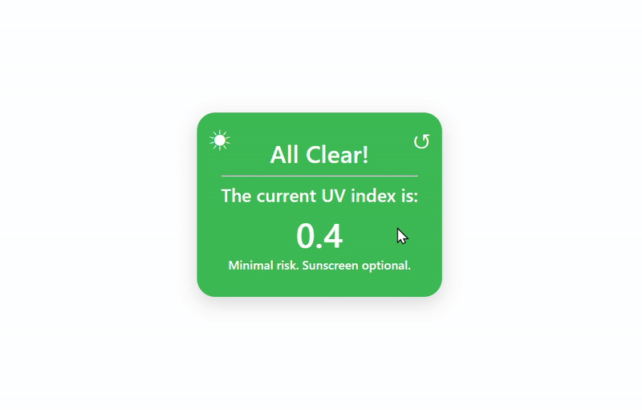
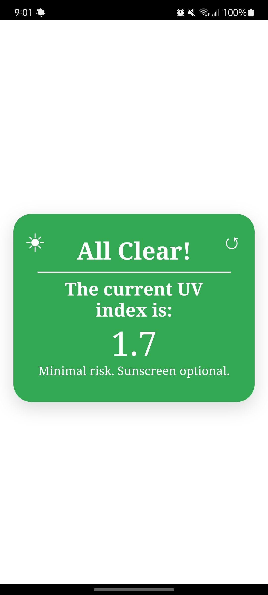
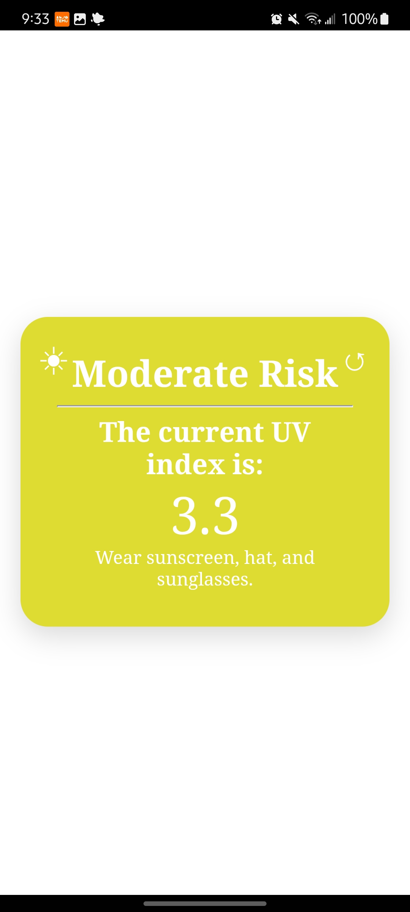
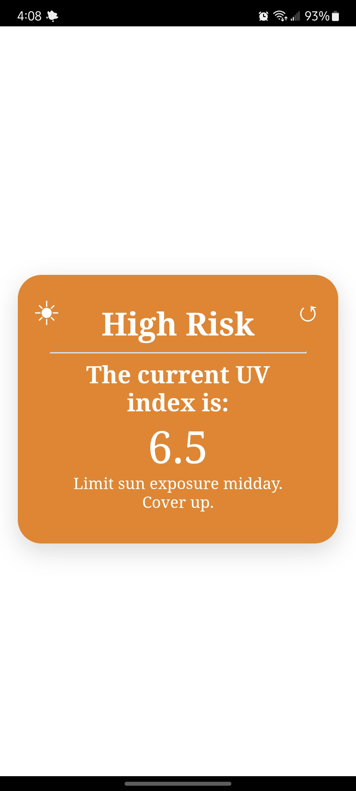
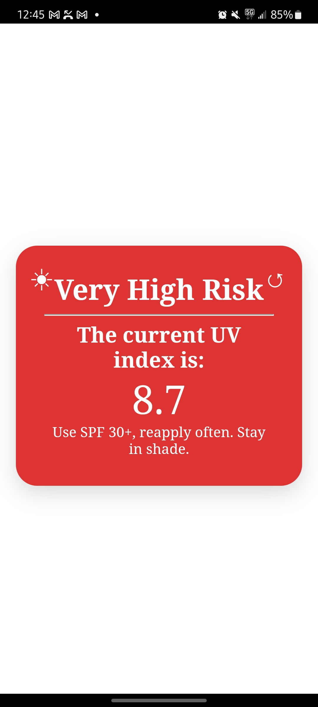

# UV Index Checker
A simple web application that displays the current UV index based on the user's location.

## Learning Focus
As part of this project, I also briefly explored using Capacitor to package the app as an Android application. This was an experimental exercise to understand how web applications can be adapted for mobile platforms.

## Features
- Automatically detects your location and fetches the UV index
- Color-coded UV risk levels
- Personalized safety tips for sun protection (via the sun icon)
- Manual refresh button

## Project Status
This project was built as a learning exercise and is no longer actively maintained. The UI and client-side logic remain intact, but the serverless API previously used to fetch live UV data is no longer deployed. As a result, the current version focuses on the frontend implementation and design rather than end-to-end functionality.

## App Preview

  
  
  
  

